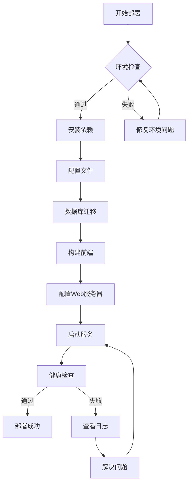

# CMMS 系统部署指南

本文档提供CMMS系统的完整部署指南，包括开发环境、测试环境和生产环境的部署。

## 📑 文档目录

1. [环境准备](01-environment-preparation.md) - 服务器环境和依赖安装
2. [后端部署](02-backend-deployment.md) - ThinkPHP后端部署
3. [前端部署](03-frontend-deployment.md) - Vue 3前端部署
4. [小程序部署](04-miniprogram-deployment.md) - 微信小程序发布
5. [Docker部署](05-docker-deployment.md) - Docker容器化部署
6. [性能优化](06-performance-optimization.md) - 生产环境优化
7. [监控维护](07-monitoring-maintenance.md) - 系统监控和日常维护
8. [备份恢复](08-backup-recovery.md) - 数据备份和灾难恢复

## 🎯 快速部署

### 最小化部署（开发环境）

```bash
# 1. 后端部署
cd backend
composer install
cp .env.example .env
# 编辑 .env 配置数据库
php migrate.php

# 2. 前端部署
cd frontend-web
npm install
npm run build

# 3. 访问系统
# 打开浏览器访问 http://localhost:3000
```

### 生产环境部署

请按照以下顺序完整阅读和执行：

1. **环境准备** → [01-environment-preparation.md](01-environment-preparation.md)
2. **后端部署** → [02-backend-deployment.md](02-backend-deployment.md)
3. **前端部署** → [03-frontend-deployment.md](03-frontend-deployment.md)
4. **性能优化** → [06-performance-optimization.md](06-performance-optimization.md)
5. **监控维护** → [07-monitoring-maintenance.md](07-monitoring-maintenance.md)

## 📋 部署检查清单

### 部署前检查

- [ ] 服务器配置满足最低要求
- [ ] 域名已备案（国内）
- [ ] SSL证书已准备
- [ ] 数据库已创建
- [ ] Redis已安装
- [ ] 防火墙规则已配置

### 后端部署检查

- [ ] PHP >= 8.1
- [ ] MySQL >= 8.0
- [ ] Redis >= 7.0
- [ ] Composer依赖已安装
- [ ] .env配置已修改
- [ ] 数据库迁移已执行
- [ ] JWT密钥已修改
- [ ] runtime目录权限正确

### 前端部署检查

- [ ] Node.js >= 18.0
- [ ] npm依赖已安装
- [ ] API_BASE_URL已配置
- [ ] 构建成功无错误
- [ ] Nginx配置正确
- [ ] Gzip压缩已启用

### 小程序部署检查

- [ ] 小程序AppID已申请
- [ ] 服务器域名已配置
- [ ] HTTPS证书有效
- [ ] 业务域名已白名单
- [ ] 代码已上传
- [ ] 版本已审核
- [ ] 已发布上线

### 部署后验证

- [ ] 后端API健康检查通过
- [ ] 前端页面正常加载
- [ ] 用户可以正常登录
- [ ] 工单可以正常创建
- [ ] 小程序可以正常访问
- [ ] 数据库连接正常
- [ ] Redis连接正常
- [ ] 日志正常输出

## 🔧 系统架构图

```
                    用户访问
                       ↓
        ┌──────────────┴──────────────┐
        │                             │
   Web前端                    小程序端
  (Nginx)                     (微信服务器)
        │                             │
        └──────────────┬──────────────┘
                       ↓
              Nginx反向代理
        (SSL终止 + 负载均衡)
                       ↓
              ┌────────┴────────┐
              │                 │
         后端API1         后端API2
        (PHP-FPM)         (PHP-FPM)
              │                 │
              └────────┬────────┘
                       ↓
        ┌──────────────┴──────────────┐
        │                             │
    MySQL主库                  Redis缓存
   (InnoDB引擎)              (会话+队列)
        │
    MySQL从库
   (读写分离)
```

## 🚀 部署流程图



## 📊 性能指标

### 目标性能

- **API响应时间**: P95 < 200ms
- **页面加载时间**: < 2秒
- **并发用户**: 50+ 同时在线
- **系统可用性**: 99.5% 月度可用性
- **数据库查询**: < 100ms (95%)

### 监控指标

- CPU使用率 < 80%
- 内存使用率 < 80%
- 磁盘使用率 < 80%
- 网络带宽 < 70%
- 数据库连接数 < 80%

## 🔐 安全检查清单

### 基础安全

- [ ] 所有密码使用强密码
- [ ] JWT密钥已修改为随机值
- [ ] 数据库密码已修改
- [ ] Redis密码已设置
- [ ] DEBUG模式已关闭
- [ ] 错误显示已关闭

### 网络安全

- [ ] 仅开放必要端口
- [ ] 防火墙规则已配置
- [ ] SSL/TLS证书有效
- [ ] HTTPS强制跳转已启用
- [ ] API限流已配置
- [ ] DDoS防护已启用

### 应用安全

- [ ] SQL注入防护
- [ ] XSS防护
- [ ] CSRF防护
- [ ] 文件上传限制
- [ ] 输入验证
- [ ] 权限检查

## 🆘 故障排除

### 常见问题

1. **后端500错误**
   - 检查PHP错误日志
   - 检查文件权限
   - 检查数据库连接

2. **前端无法访问API**
   - 检查Nginx配置
   - 检查CORS设置
   - 检查API状态

3. **数据库连接失败**
   - 检查MySQL服务状态
   - 检查.env配置
   - 检查防火墙规则

4. **小程序无法登录**
   - 检查域名白名单
   - 检查HTTPS证书
   - 检查session配置

## 📞 技术支持

如果在部署过程中遇到问题：

1. 查看对应的详细部署文档
2. 查看系统日志
3. 搜索[Issues](https://github.com/yourusername/cmms/issues)
4. 提交新的Issue

## 📝 更新日志

- **2026-03-20**: 创建部署指南
- 待更新...

---

**下一步**: [环境准备](01-environment-preparation.md) →
