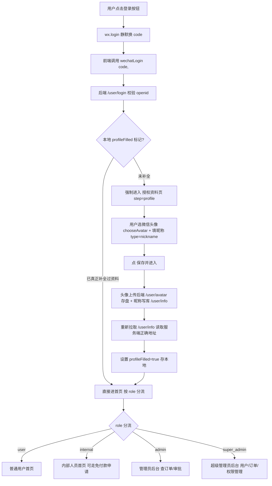
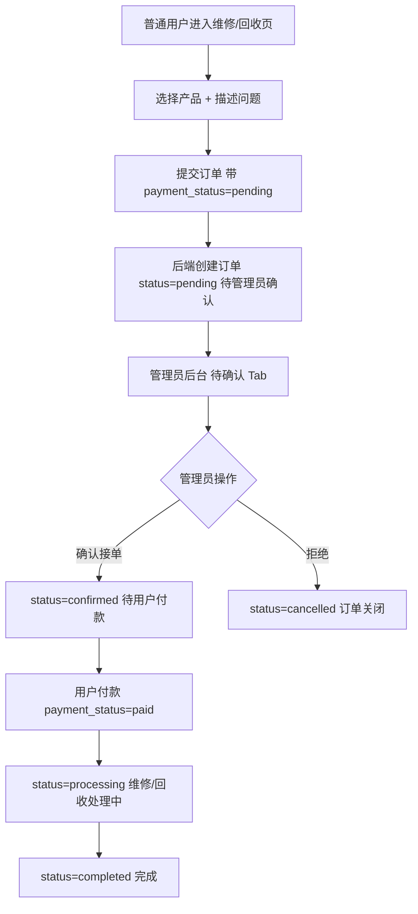
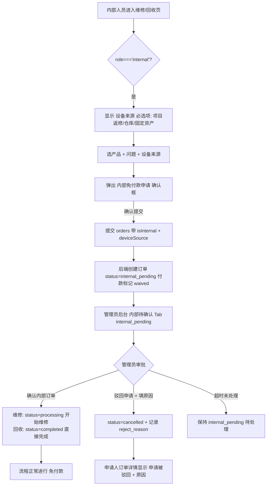
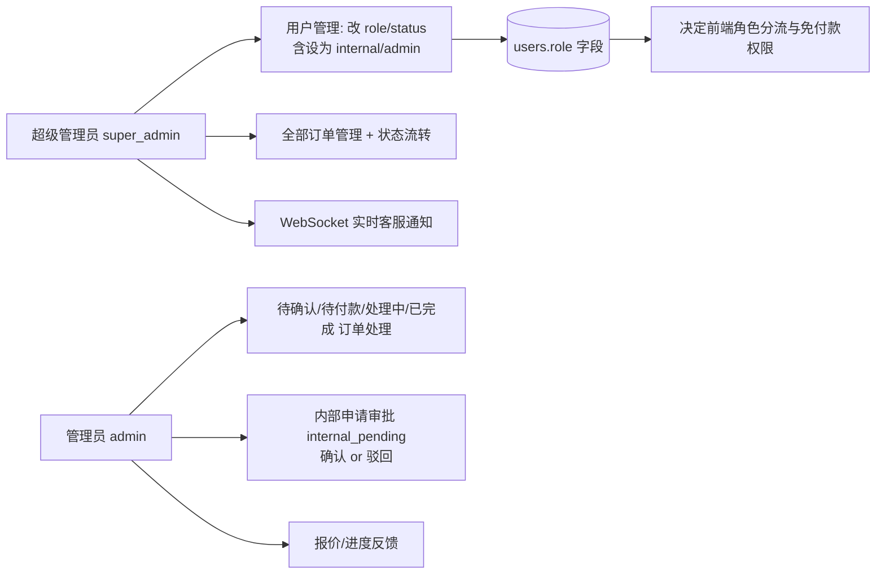

# 核心业务流程图

> 基于代码实际逻辑梳理（前端 `pages/*` + 后端 `backend/routes/*`）。
> 角色：`user`（普通用户）、`internal`（内部人员/免付款申请）、`admin`（管理员）、`super_admin`（超级管理员）。

---

## 一、登录与身份授权流程

**说明**
- 旧脏头像（`http://域名/uploads/...` 缺 `/mp-api/api` 前缀）现被 `needProfileFill` 判定为"需补全"，重新登录即可强制修正。
- WebSocket 实时通知 `wss://zych.net.cn/mp-api/ws/chat` 失败为服务器 nginx 未反代 `/mp-api/ws`（需服务器加 Upgrade 头配置，代码无需改）。

---

## 二、普通用户 维修/回收 下单流程

---

## 三、内部人员（免付款）维修/回收 申请流程 ⭐本次重点

**本次修复的缺口（图中 ⛔ 驳回分支）**
- 前端管理员页原仅有"确认"按钮，已补"驳回申请"按钮 + 原因输入弹窗（`admin-orders.wxml` / `admin-orders.js`）。
- 后端详情接口原未返回 `reject_reason`，已补该字段（`orderRoutes.js`）。
- 申请人侧订单详情新增"申请被驳回 + 原因"展示（`order-detail.js` / `.wxml`）。

---

## 四、管理员/超级管理员 权限与审批总览

**角色枚举**（来自 `backend/middleware/auth.js` `ROLES`）
- `user`：普通用户，正常付款下单。
- `internal`：内部人员，下单走免付款申请，需管理员审批。
- `admin`：管理员，处理订单与内部申请审批。
- `super_admin`：超级管理员，用户/权限/订单全量管理。

---

## 五、关键数据表字段映射

| 字段 | 含义 | 取值 |
|------|------|------|
| `users.role` | 角色 | `user` / `internal` / `admin` / `super_admin` |
| `orders.status` | 订单状态 | `pending` / `confirmed` / `processing` / `completed` / `cancelled` / `internal_pending` / `admin_created` |
| `orders.is_internal` | 是否内部免付款单 | 0 / 1 |
| `orders.device_source` | 内部设备来源 | `project_return`(项目返修) / `warehouse`(仓库) / `fixed_asset`(固定资产) |
| `orders.payment_status` | 付款状态 | `pending` / `paid` / `waived`(免付款) |
| `orders.reject_reason` | 内部申请驳回原因 | 管理员填写文本 |

---

## 六、端到端测试路径（内部人员流程）

1. 服务器 `UPDATE users SET role='internal' WHERE id=<你的id>;` → **重新登录**。
2. 维修/回收页选产品+问题 → 选设备来源 → 确认提交 → "内部申请已提交，待管理员确认"。
3. 管理员页"内部待确认"Tab → 打开订单：
   - **确认内部订单** → 维修变"维修中"/回收变"已完成"（免付款）。
   - **驳回申请** → 填原因 → 订单变"已取消"。
4. 内部人员"我的订单"→ 详情可见"⛔ 申请被驳回 + 原因"。
5. 后端 `orderRoutes.js` 改动需 `docker compose up -d --build miniprogram-backend` 重新部署。
